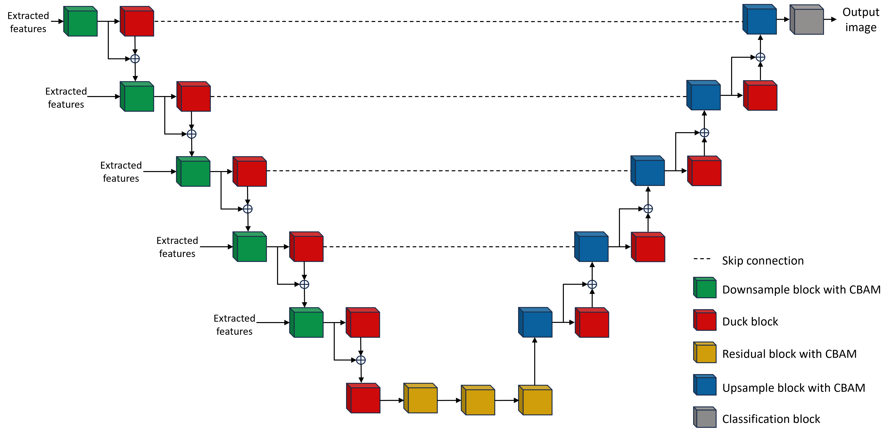
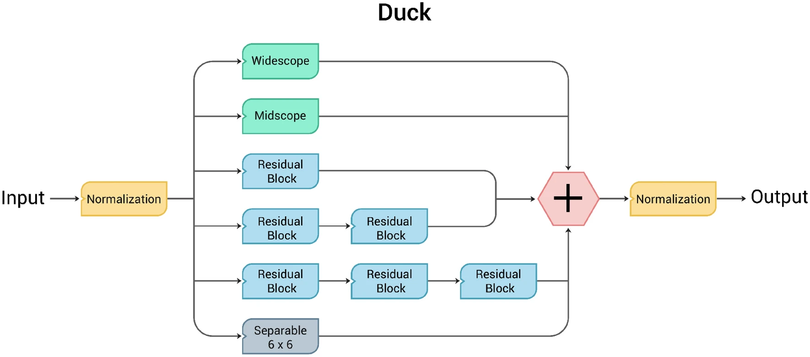
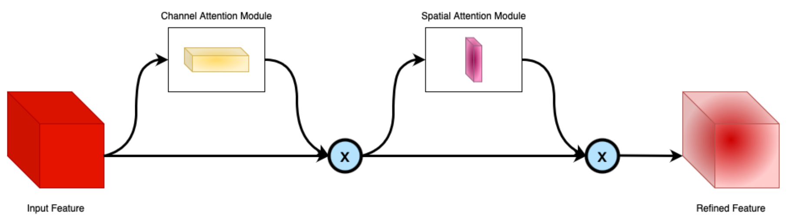

# Road Segmentation of aerial images using RA-DUCKNet
Inspired by two recently published DCNN models, namely Residual
Attention UNet (ResAttUNet) and Deep Understanding
Convolutional Kernel UNet (DUCK-Net), we developed
a new architecture that combines the main building blocks
of these two models. We call this model Residual
Attention DUCKNet (RA-DUCKNet).

Further, we created a new dataset containing some 90’000 satellite images with
a ground truth mask from urban areas in the United States. 

## Contents

- [Road Segmentation of aerial images using RA-DUCKNet](#road-segmentation-of-aerial-images-using-ra\-ducknet)
- [Installing Requirements](#installing-requirements)
- [Model details](#model-details)
- [Dataset](#dataset)
- [Training](#training)
- [Results](#results)
- [Reproduction for the Competition](#reproduction-for-the-competition)
  
## Installing Requirements
All requirements can be found in the `requirements.txt` and can be installed using 
```
pip install -r requirements.txt
```
in a venv or in a conda environment (recommended) using:
```
conda install --yes --file requirements.txt
```
## Model details
Our models combines the ideas of the ResAttUNet and DUCK-Net. We use the ResAttUNet as a basis and add DUCK-blocks to he down and upsampling path.

We reimplement the DUCK-blocks as described in the paper.

(source: Figure 6, Dumitru et al. 2023 [paper](https://www.nature.com/articles/s41598-023-36940-5))

The Downsample/Upsample blocks with CBAM use a spatial and channel attention module. For this, we use the implementation of the original ResAttUNet by Mohammed [github](https://github.com/sheikhazhanmohammed/SADMA#sadma-satellite-based-marine-debris-detection)

(source: Figure 1, Mohammed 2022 [paper](https://arxiv.org/abs/2210.08506))

We further use an EfficientNet-B5 model for feature extraction which is then fed into the UNet-like structure at the appropriate levels.

## Dataset
We build our own dataset from satellite images from Google Maps. In total, we pulled 65k aerial images of the
greater area around US cities namely Los Angeles, Boston,
Houston, Chicago, Phoenix, Philadelphia, and San Francisco
which have an especially clear street and highway network.
For the ground truth, we also used Google Maps.
We provide the dataset [here](https://polybox.ethz.ch/index.php/s/TzqRXKWO1PkWAop)

## Training
For training, our model one can use the `main.py` file in the `src` folder. The file contains all the necessary parameters to train the model.

The SMP models can be trained using the `smp.py` file in the `src` folder. With the option `--model` one can specify a non-default decoder. The same can be done for the encoder with `--encoder`. For further options see the file. 

We trained all our models on a single Nvidia A100 GPU (80GB) for around 20 Epochs.
## Results
| Model      | IoU         | F1            | F2            | Accuracy      | Recall        |
|------------|-------------|---------------|---------------|---------------|---------------|
| UNet       | 0.58        | 0.73          | 0.71          | 0.95          | 0.68          |
| ResAttUNet | 0.60        | 0.75          | 0.72          | 0.95          | 0.68          |
| RA-DUCKNet | 0.68        | 0.81          | 0.78          | 0.97          | 0.74          |
| DeepLabV3+ | 0.71        | 0.83          | 0.79          | 0.97          | 0.75          |
| UNet++     | 0.73        | 0.84          | 0.80          | 0.97          | 0.76          |

## Reproduction for the Competition
After downloading our dataset and the competition dataset and unpacking both into the data folder. The path to the competition dataset should be something like `data/ethz-cil-road-segmentation-2023/` with the subfolders `training` and `test`.
Next one can simply run the `train_our_model.py` file to train the RA-DUCKNet model this will take a long time as we trained for multiple days. To train the SMP models first use the `smp.py` file with the following options for the specific options:
```
model_name=UnetPlusPlus/DeepLabV3Plus
encoder_name=efficientnet-b5
encoder_weight=imagenet
epochs=30
batch_size=32
learning_rate=0.0001
```
Choosing either model name. After that, the model can be fine-tuned using the `smp_dice.py` file with the same options setting the `--load-model` option and lowering the lr to 0.00001.
To finally create a submission one can use `make_smp_ensamble_submission.py -w -b 16 -o "ensemble-tta.csv" -bm -tta`
