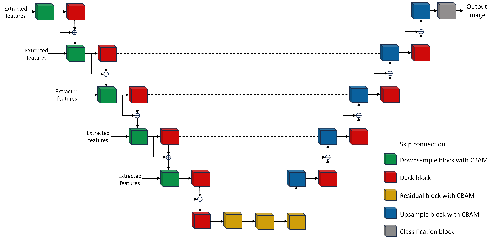

# Road Segmentation of aerial images using RA-DUCKNet
Inspired by two recently published DCNN models, namely Residual
Attention UNet (ResAttUNet) and Deep Understanding
Convolutional Kernel UNet (DUCK-Net), we developed
a new architecture that combines the main building blocks
of these two models. We call this model Residual
Attention DUCKNet (RA-DUCKNet).

Further, we created a new dataset containing some 65’000 satellite images with
a ground truth mask from urban areas in the United States. 

## Contents

- [Road Segmentation of aerial images using RA-DUCKNet](#road-segmentation-of-aerial-images-using-ra\-ducknet)
- [Installing Requirements](#installing-requirements)
- [Model details](#model-details)
- [Dataset](#dataset)
- [Training](#training)
- [Results](#results)
  
## Installing Requirements
All requirements can be found in the `requirements.txt` and can be installed using 
```
pip install -r requirements.txt
```
in a venv or in a conda environment (recommended) using:
```
conda install --yes --file requirements.txt
```
## Model details
Our models combines the ideas of the ResAttUNet and DUCK-Net. We use the ResAttUNet as a basis and add DUCK-blocks to he down and upsampling path.

We reimplement the DUCK-blocks as described in the paper.

(source: Figure 6, Dumitru et al. 2023 [paper](https://www.nature.com/articles/s41598-023-36940-5))

The Downsample/Upsample blocks with CBAM use a spatial and channel attention module. For this, we use the implementation of the original ResAttUNet by Mohammed [github](https://github.com/sheikhazhanmohammed/SADMA#sadma-satellite-based-marine-debris-detection)

(source: Figure 1, Mohammed 2022 [paper](https://arxiv.org/abs/2210.08506))

We further use an EfficientNet-B5 model for feature extraction which are then fed into the UNet like structure at the appropriate levels.

## Dataset
We build our own dataset from satellite images from Google Maps. In total, we pulled 65k aerial images of the
greater area around US cities namely Los Angeles, Boston,
Houston, Chicago, Phoenix, Philadelphia, and San Francisco
which have an especially clear street and highway network.
For the ground truth, we also used Google Maps.
As Google Maps is proprietary, we cannot share the dataset. However, we provide the code to create your own dataset from Google Maps in the `data` folder.
We can be reached at per [Mail](ywattenberg@ethz.ch) for further questions.
## Training
For training, our model one can use the `main.py` file in the `src` folder. The file contains all the necessary parameters to train the model. The model is trained on a single A100 GPU with 80GB of Memory.

The SMP models can be trained using the `smp.py` file in the `src` folder. With the options `--model` one can specify a non-default decoder. The same can be done for the encoder with `--encoder`. For further options see the file. The model is trained on a single A100 GPU with 80GB of Memory. 
## Results

